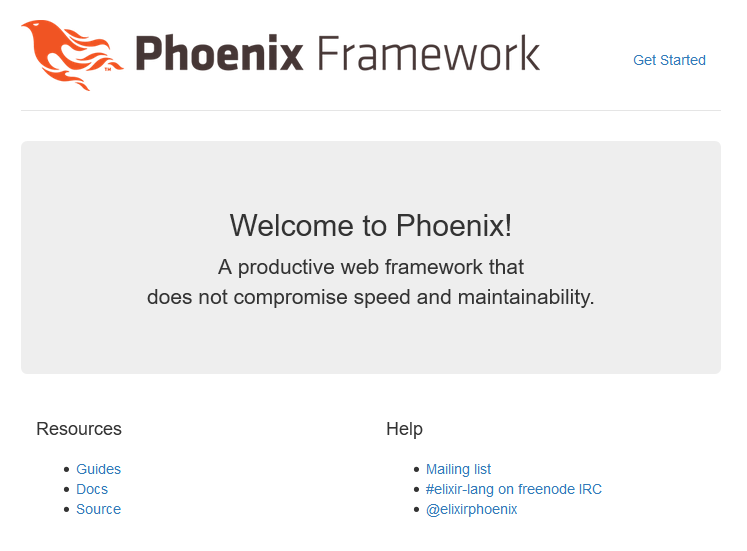

Phoenix Up and Running
======================
A little bit off topic this one, I decided to burn up a few hours looking at something far from my comfort zone.

Phoenix - A modern web framework that has gained some traction and is built from a really interesting stack, for more information see here: http://www.phoenixframework.org/

This Vagrant / Virtual box machine boots up an Ubuntu operating system and installs all of the ingredients to get started with Phoenix
* elixir
* node
* postgresql  

The demo also contains a script in /tmp named create_testapp.sh which if run will do just enough to get the Phoenix placeholder page up and running.

The basics of Phoenix can be learnt fairly quickly, the difficulty is trying to understand all of the components and the part they play in the Phoenix eco system.

The first thing to learn is mix which is almost the equivalent of Rake for Ruby; mix is basically a set of scripts or task plugins to carry out automated actions.

Requirements
------------
To use this demonstration you will need

    VirtualBox which can be downloaded from here: https://www.virtualbox.org/wiki/Downloads
    Vagrant which can be downloaded from here: https://www.vagrantup.com/downloads.html
    

Tested with VirtualBox 5.1.22 Tested with Vagrant 1.9.5

Usage
-----
After installing the pre-requisites, change to the root folder of this project and run

```
vagrant up
```

Vagrant will download an ubuntu box and provision it with shell commands.

When Vagrant has finished it's run you can run the Phoenix demo by ssh into the VM
```
vagrant ssh
```

After logging in change to /tmp folder and run create_testapp.sh, reply Y to the prompts

```
cd /tmp
./create_testapp.sh
```

Open a browser on the host type navigate to http://localhost:4000



Or in a shell on the guest use wget or curl.

Contributing
------------
Get latest. Make changes, write tests, get code review, check in. 

License and Authors
-------------------
Please see [LICENSE][licence]
Authors: Chris Sullivan

[licence]: https://github.com/chrisgit/phoenix-up_and_running/blob/master/LICENSE
